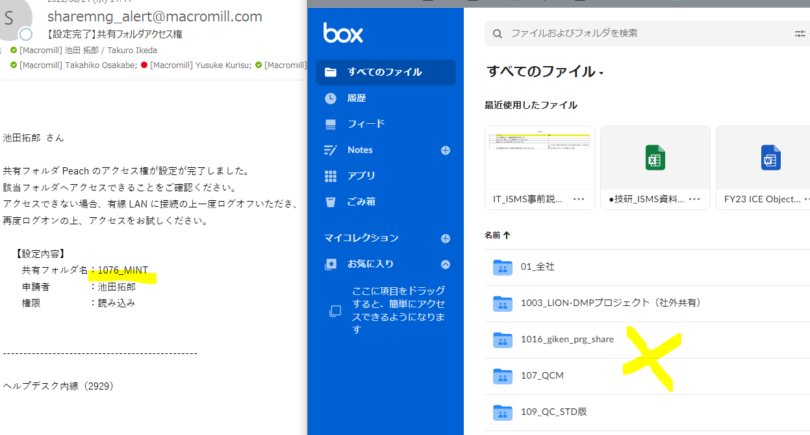

---
html:
# 画像をHTMLファイル内に埋め込むときはtrueにする
  embed_local_images: false
  embed_svg: false
# 謎
  offline: false
# HTML出力時にサイドバーにtoc(目次)を生成する
# これを有効にするには、ユーザー設定でmarkdown-preview-enhanced.enableScriptExecutionをtrueにする。
  toc: true
  
# trueだと、md保存時にHTMLも生成される
export_on_save:
  html: true

---

# テキスト解析でできること

- 品詞分解：文章を、単語にバラバラに分解する。

- 単語ランキング：単語を出現回数によってランキングする。
- 文章ランキング：文章を単語の出現回数によってランキングする
- ワードクラウド：単語からワードクラウドを作成する
- ネットワーク：単語の共起（同じ文章の中に出てくる回数）によってネットワーク図を作成する。

# 品詞分解

品詞分解
強制マージチェック

# 単語ランキング

単語ランキング

# 文章ランキング

文章ランキング

# ワードクラウド

ワードクラウド

# ネットワーク

共起ネットワーク

# よくある質問

**Q:日本語以外の分析は可能か？**
A:現在、日本語・英語・中国語に対応しています。

**Q:品詞分解の品詞の種類は？**
A:初期設定では「形容詞・動詞・名詞・副詞」の４品詞で、それ以外の品詞は削除されます。副詞のみオプションで削除できるほか、分解後に品詞での絞り込みも可能です。
      
**Q:文章ランキングの「代表スコア」のとは？**
A:分析対象となる文章がどの程度「代表的な文章か」を把握するためのMMR独自指標で、文章に含まれる単語のデータ全体における出現回数を合計したものです。
例えば「リンゴが好き」という文章について、「リンゴ」の全体における出現回数が５、「好き」の出現回数が７の場合、「リンゴが好き」の代表スコアは = 5+7 =12となります。「が」は頻度の取り扱い範囲外なので、採点しません。

**Q:ランキングメニューの「代表スコア]と「一文字当たり代表スコア」の違いは？**
A:「一文字当たり代表スコア」＝「代表スコア」／「文字数」です。文字数が多いほど代表スコアは多くなるため、文字数で割っています。

**Q:表のレイアウトが崩れているがどうしたら戻るか？**
A:表頭（上部）の並び替えボタン（三角形のボタン）を押していただくと、戻ります。

**Q:ワードクラウドの画像指定がうまくいかない。**
A:クラウド用画像は、目的の形を完全に真っ黒で塗りつぶしたpngファイルのみ対応です。

**Q:データが読み込めない**
A:列名に重複や空白があるとエラーになります。