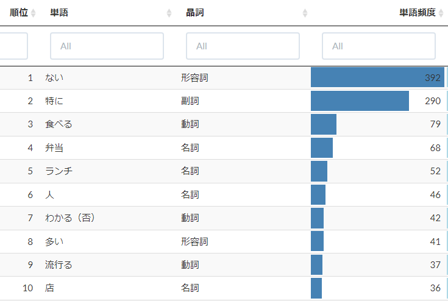

# テキスト解析

## テキスト解析でできること

- 品詞分解：文章を、単語にバラバラに分解する。
- 単語ランキング：単語を出現回数によってランキングする。

- 文章ランキング：文章を単語の出現回数によってランキングする
- ワードクラウド：単語からワードクラウドを作成する
- ネットワーク：単語の共起（同じ文章の中に出てくる回数）によってネットワーク図を作成する

## 品詞分解

## 単語ランキング

## 文章ランキング

## ワードクラウド

## ネットワーク

