---
html:
# 画像をHTMLファイル内に埋め込むときはtrueにする
  embed_local_images: false
  embed_svg: false
# 謎
  offline: false
# HTML出力時にサイドバーにtoc(目次)を生成する
# これを有効にするには、ユーザー設定でmarkdown-preview-enhanced.enableScriptExecutionをtrueにする。
  toc: true
  
# trueだと、md保存時にHTMLも生成される
export_on_save:
  html: true

---

# テキスト解析でできること
こちらでは、MMRのテキスト解析でできることと、大まかな流れをご紹介します。
まずテキスト解析でできることは以下の通りです。
- 品詞分解：文章を単語（品詞）に分解する。

- 単語ランキング：単語を出現回数によってランキングする。

- 文章ランキング：文章を、その文章に含まれる単語の出現回数によってランキングする。
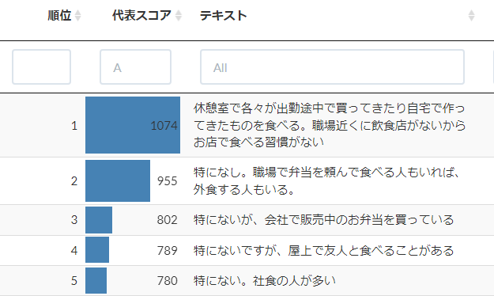
- ワードクラウド：単語からワードクラウドを作成する。

- ネットワーク：単語の共起（同じ文章の中に出てくる回数）によってネットワーク図を作成する。

# 品詞分解
## 品詞分解とは
品詞分解とは、文章を単語（品詞）に分解することを言います。
MMRでは名詞・動詞・副詞・形容詞のみに絞っています。助詞（「は」や「が」等）は除外されます。

下図は、MMRでの品詞分解の様子です。データの中の複数の文章を一気に分解できます。

## 品詞分解のながれ
1. 分析データの読み込み
分析したいテキストの入ったデータファイルを選択して、アップロードして読み込みます。
もしデータが無くても機能を試しに使ってみたいときは「学習用のサンプルデータ」を選んでください。
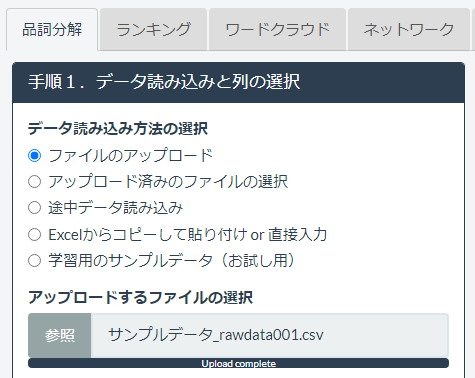
1. 列の選択
「分析するテキスト列」として、データの中の分解したい文章の入った列を選びます。
「分析区分として使う列」には、分析の区分として使いたい列を選びます。

1. 品詞分解の実行
分析時の設定（言語の選択やユーザー辞書など）を行ってから、実行ボタンを押すと、文章が品詞（単語）に分解されます。
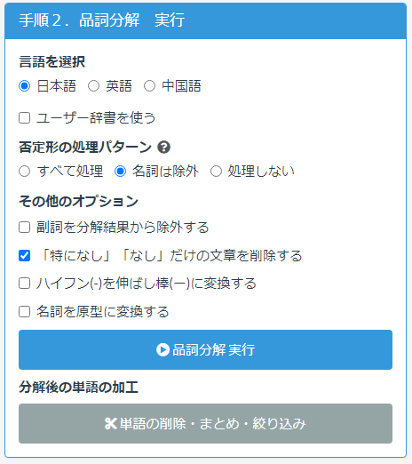
下図は、分解された文章と単語の様子です。
分解結果はダウンロードボタンでダウンロードしたり、コピーしたりすることができます。

1. 分解後の単語の加工
品詞分解後に「単語の削除・まとめ・絞り込み」を押すと、分解した単語の一部を削除したり、表記ゆれをまとめたりすることができます。

（例）分解後に、「弁当」という単語を削除すると、

分解結果から「弁当」が消えます。

# 単語ランキング
## 単語ランキングとは
単語ランキングとは、品詞分解結果の単語が、元の文章データの中にどれだけ多く含まれているか？をランキングにしたものです。
例えば元データが
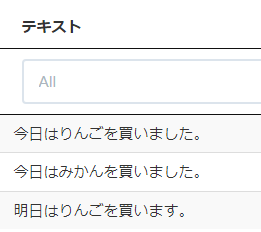
の場合、品詞分解した結果は、
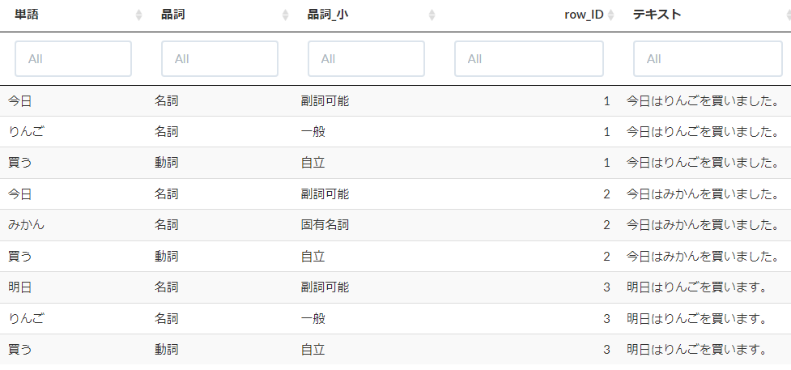
となり、単語ごとに出てきた数（出現頻度）を数えてランキングにすると、下図のようになります。
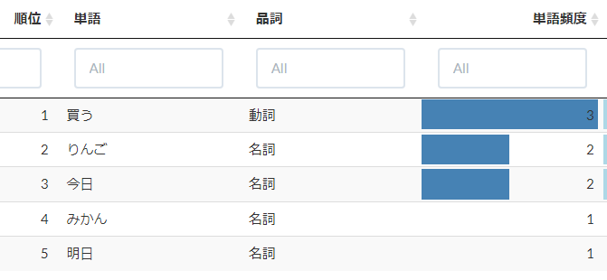

この単語ランキングによって、そのデータでどのような単語が多く使われているかを簡単に把握することができます。
## 単語ランキングのながれ
▼MMRでの単語ランキング完成のイメージです。以下、おおまかな手順をご紹介します。

単語ランキングは、品詞分解が終わったところからスタートします。
1. 単語ランキング実行ボタンを押します。

1. 単語ランキングが生成されます。
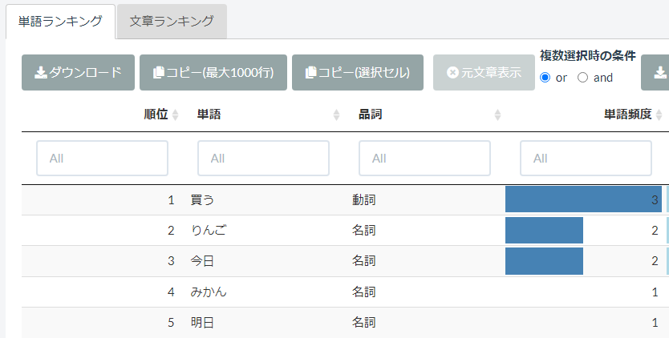

## 区分別の単語ランキング
元のデータに分析区分がある場合には、区分ごとにランキングを生成できます。
例えば以下のような「性別」の情報のあるデータの場合、
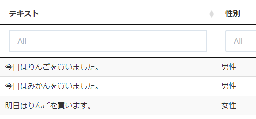
「区分別にランキングする」にチェックを入れて、分析の区分に「性別」を選択すると、
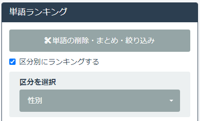
区分ごと（この場合は性別ごと）の単語ランキングを作ることができます。
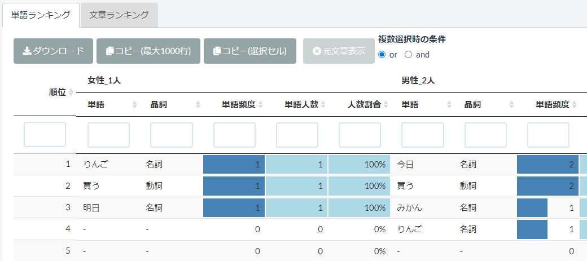

区分別の単語ランキングを使うと、分析区分ごとの単語の出現傾向を簡単につかむことができます。

## 単語の元文章の表示
ランキングを作成したあとに、ランキングの中の特定の単語について、それがどのような文章に含まれているか、分解前の元文章を表示する事ができます。
1. 単語ランキングの表の中の、単語をクリックして選択
2. 「元文章表示」ボタンを押す

3. 選択した単語を含む元文章が表示されます。

4. 単語の選択は複数選ぶこともできます。その場合、選んだ単語をすべて含める文章のみ表示（and条件）にするか、選んだ単語のどれかを含める文章をすべて表示（or条件）にするか、設定することができます。

# 文章ランキング
## 文章ランキングとは
文章ランキングとは、文章に含まれる単語の出現頻度の合計（代表スコア）によって、文章をランキングにしたものです。
ランキング上位の文章ほど「データによく出てくる単語をたくさん含んでいる文章」、つまりデータを代表する文章であると言えます。

例えば下図の例では、

データ全体において「今日」は2回、「りんご」は2回、「買う」は3回、出てきます。
よって「今日はりんごを買いました」という文章の代表スコアは、
今日2 + りんご2 + 買う3 = 7 となります。
同様に「今日はみかんを買いました」は、
今日2 + みかん1 + 買う3 = 6 となります。
よって「今日はりんごを買いました」が最も代表的な文章と言えます。
## 文章ランキングのながれ
▼MMRでの文章ランキング完成のイメージです。以下、おおまかな手順をご紹介します。

文章ランキングは、品詞分解が終わったところからスタートします。
1. 文章ランキング実行ボタンを押します。
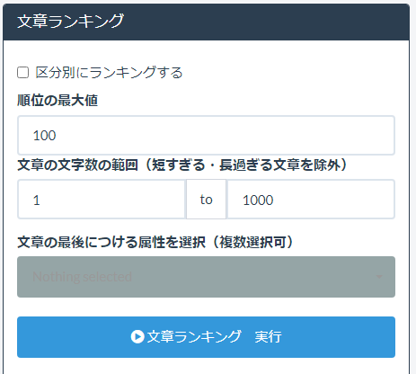
1. 文章ランキングが生成されます。
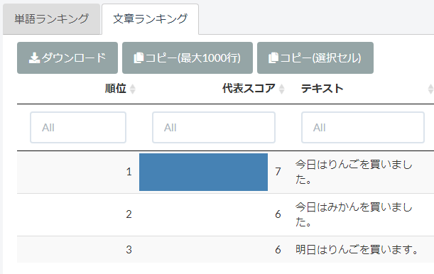

## 区分別ランキング
単語ランキング同様、分析区分を選択して、区分ごとのランキングを作ることができます。

# ワードクラウド
## ワードクラウドとは
ワードクラウドとは、データ内の単語を雲（クラウド）のように表示した図のことです。
単語ランキングと内容的には同じものですが、単語の大きさや色を変えることで、単語の出現頻度を直感的に把握することができます。

（例）ランキングとワードクラウドの比較

（例）MMRで作成したワードクラウド（円形）

（例）MMRで作成したワードクラウド（鳥の形）
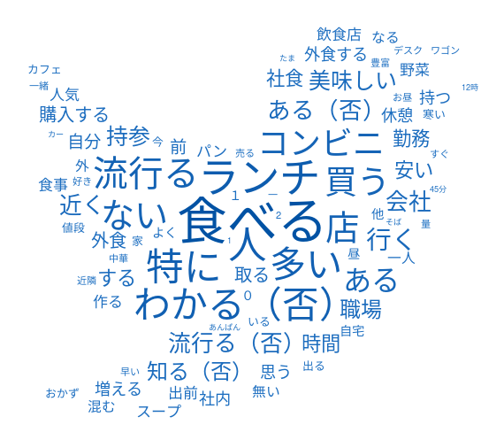

## ワードクラウドのながれ
▼MMRでのワードクラウド完成のイメージです。以下、おおまかな手順をご紹介します。

ワードクラウドは品詞分解が終わったところからスタートします。
1. データの選択、クラウドの形を選びます。
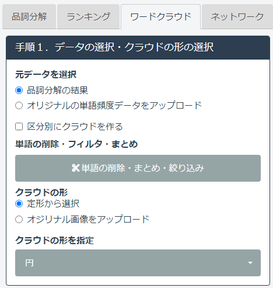

1. クラウドの文字の色や大きさ、単語をどれくらい表示するかを設定して、実行ボタンを押します。

1. クラウドが生成されます。クラウドをダウンロードするには、マウスで右クリックして「画像として保存」してください。
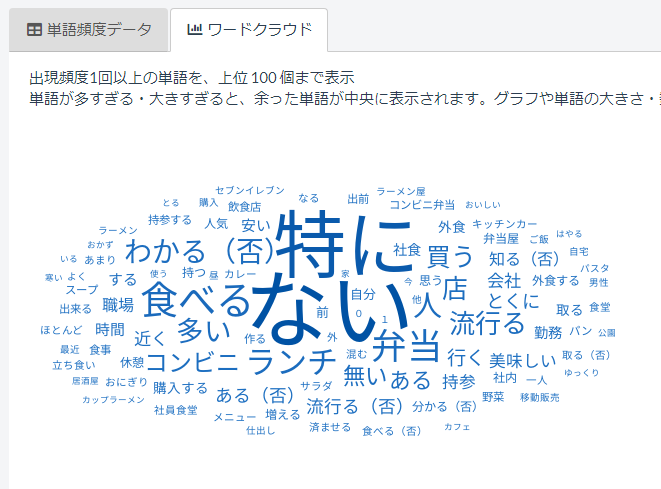

# ネットワーク

## ネットワークとは
ネットワークとは、ある２つの単語が１つの文章に両方入っていること（これを共起と呼びます）を単語のつながりと考えて、それをネットワーク図で表したものです。
共起ネットワークとも呼ばれます。

図の中で線でつながれている単語は、「同じ文章の中に出てくる回数が多い」と言えます。
また単語のつながり具合から、複数の単語をコミュニティと呼ばれるグループに分けて、色をつけることもできます。同じ色＝同じコミュニティに属する単語は、同じ文章の中で出てきやすい単語と言えます。

## ネットワークのながれ